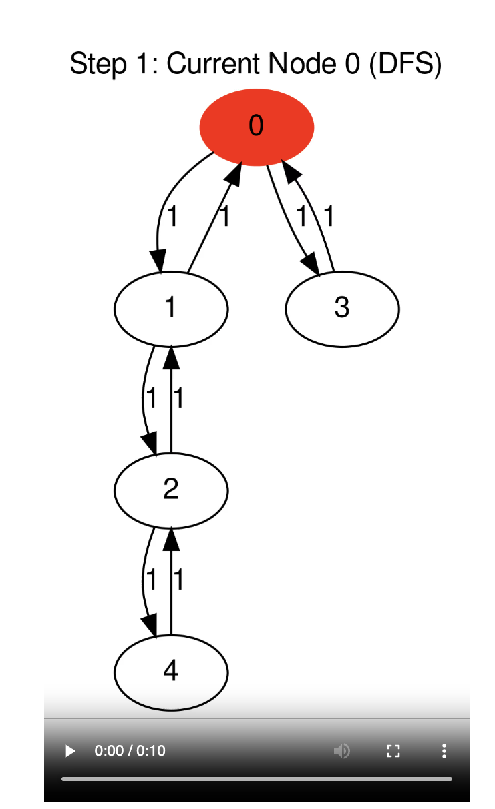
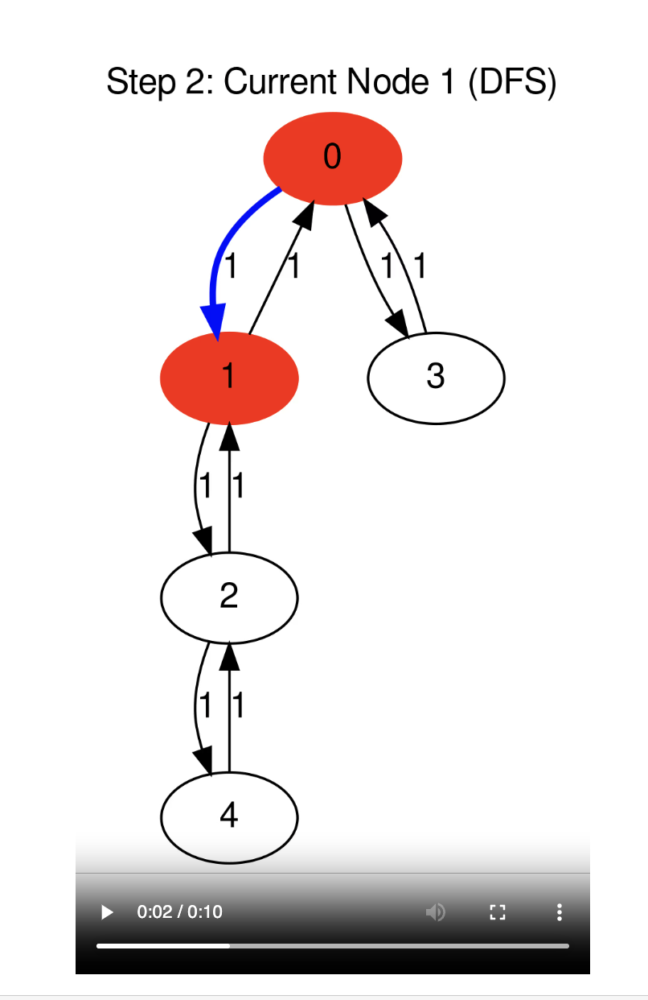
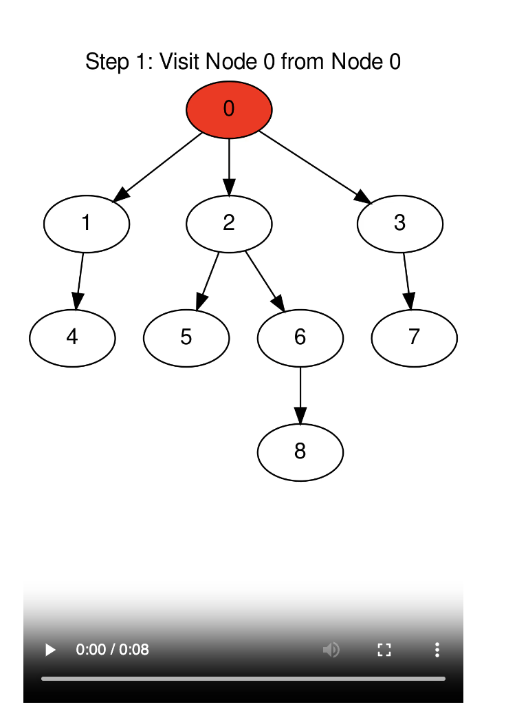
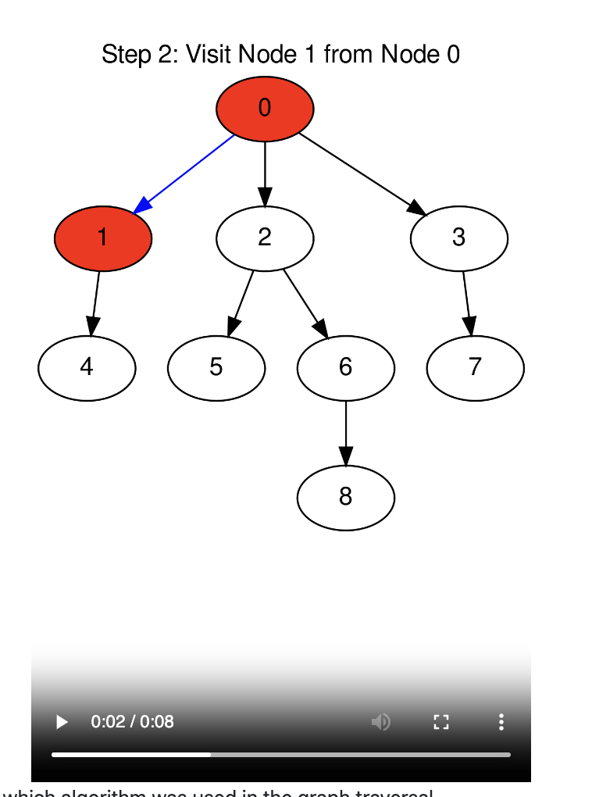
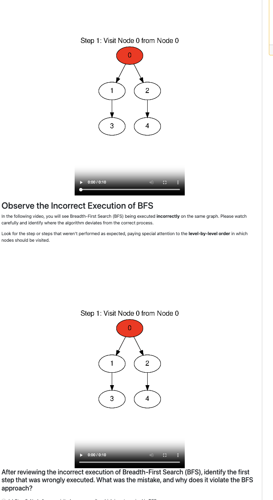
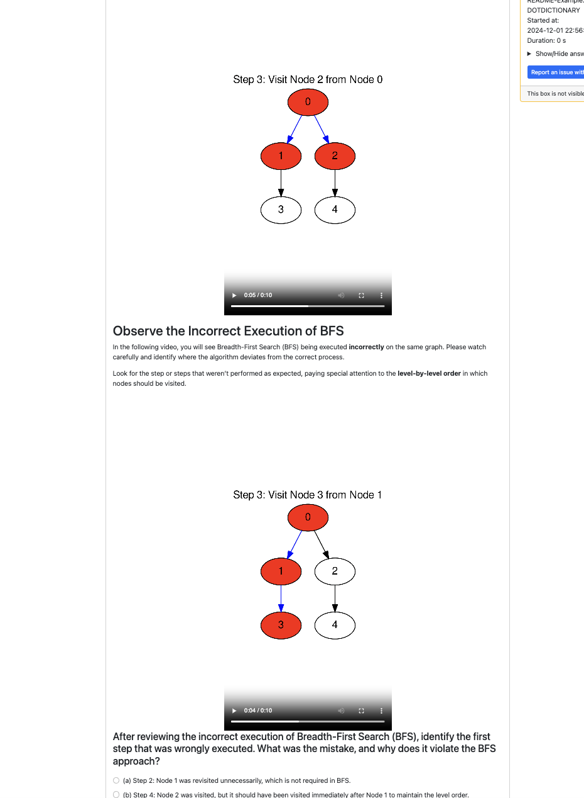

# pl-graph-animate

## Introduction

The `pl-graph-animate` element is a powerful tool for creating engaging and visually dynamic animations of graph-related problems within the PrairieLearn platform. Designed to aid in the teaching and learning of graph algorithms, this element offers a flexible approach to building animations that showcase how these algorithms operate step-by-step.

`pl-graph-animate` provides two intuitive methods to generate animations:
## Requisites
At the moment one of the libraries named moviepy is not suppported by the PrairieLearn environment. It must be added locally. You can achieve this by running the following command 
```bash
docker run -it --rm -v <path-to-course>:/course prairielearn/prairielearn pip3 install --target /course/serverFilesCourse moviepy
```
## Algorithm-Based Animation: 
   Create animations by defining a graph through its adjacency matrix and specifying an algorithm to execute. Currently supported algorithms include:
   - Breadth-First Search (BFS)
   - Depth-First Search (DFS)
   - Dijkstra's Algorithm  

   This method automates the animation process, providing a clear visualization of how the selected algorithm traverses or processes the graph.
   
   **Parameters:**
- **`params-name="matrix"`**: This is the adjacency matrix which will be used to create the graph. The content of the matrix must be declared as a `np.array` in the `server.py` of the question.
- **`algorithm`**: Declare which algorithm you wish to execute in the adjacency matrix. (DFS, BFS, Dijkstra's). 
    - If not declared, the default value is **`dfs`**.
    - Examples:
        - **`algorithm="bfs"`**
        - **`algorithm="dfs"`**
        - **`algorithm="dijkstras"`**
- **`frame-duration`**: Declare the time each frame will be shown in the video (in seconds).
    - If not declared, the default value is **`2`** (seconds).
    - Example:
        - **`frame-duration=5`**
- **`show-steps`**: Provide a title for each frame. The title has the format: `Step {i}: Current Node {current_node} (algorithm)`. It will be displayed at the top of each frame in the animation.
    - If not declared, the default value is **`True`**.
    - Examples:
        - **`show-steps=True`** (Display the title in each frame)
        - **`show-steps=False`** (No title displayed)
- **`show-weights`**: Display the weights of the edges in the graph.
    - If not declared, the default value is **`False`**.
    - Examples:
        - **`show-weights=True`** (Display the weights of the edges)
        - **`show-weights=False`** (Do not display the weights)
- **`directed-graph`**: Create a directed graph.
    - If not declared, the default value is **`False`**.
    - Examples:
        - **`directed-graph=True`** (The animation will display a directed graph)
        - **`directed-graph=False`** (The animation will not display a directed graph)


**Implementation**
This example is for a animation with a bfs execution on the with all the possible parameters.
- question.html
    

```html
<pl-graph-animate 
    params-type="adjacency-matrix" 
    params-name="matrix" 
    frame-duration="2" 
    algorithm="bfs" 
    show-steps="True" 
    directed-graph="True" 
    >
</pl-graph-animate>
```

- server.py
    - This is how to properly declare the adjacency matrix in the server.py

```python
import prairielearn as pl
import numpy as np

def generate(data):
    mat=np.array([[0, 1, 0, 1, 0],
                         [1, 0, 1, 1, 0],
                         [0, 1, 0, 0, 1],
                         [1, 1, 0, 0, 0],
                         [0, 0, 1, 0, 0]])

    data["params"]["matrix"] = pl.to_json(mat)
```
**PrairieLearn Visualization**<br>

<br>

<br>


## DOT Command Dictionary  
 Create animations by defining a graph through a python dictionary containing a list of DOT commands. Each step will be a frame in the animation.
 **Parameters**
 - `params-type="dotty"` : Declare that the input of the animation will be a dictionary with DOT commands.
    -   If not declared default value = `adjacency-matrix`. You must declare `params-type="dotty"`
- `params-name="dotty-commands-dictionary"`
    - This is the dictionary which will be used to create the graph. This must be a python dictionary declared in the `server.py` file.
- `frame-duration` : Declare the time each frame will be shown in the video. Declare time in seconds.
        -   If not declared default value = `2` (seconds)
        -  `frame-duration = 5` 

**Implementation**
- question.html
    

```html
    <pl-graph-animate params-type="dotty" params-name="dotty-commands-dictionary" frame-duration=2 ></pl-graph-animate>

    After watching the video, identify which algorithm was used in the graph traversal.
```
- server.py
    - This is how to properly declare the dictionary of DOT Commands.

```python
import prairielearn as pl
import numpy as np

def generate(data):
    

    bfs_dot_commands = {
    "step_1": """
    digraph G {
        label="Step 1: Visit Node 0 from Node 0";
        labelloc="top";
        0 [style=filled, fillcolor=red];
        0 -> 1 [color=black];
        0 -> 2 [color=black];
        0 -> 3 [color=black];
        1 -> 4 [color=black];
        2 -> 5 [color=black];
        2 -> 6 [color=black];
        3 -> 7 [color=black];
        6 -> 8 [color=black];
    }
    """,
    "step_2": """
    digraph G {
        label="Step 2: Visit Node 1 from Node 0";
        labelloc="top";
        0 [style=filled, fillcolor=red];
        1 [style=filled, fillcolor=red];
        0 -> 1 [color=blue];
        0 -> 2 [color=black];
        0 -> 3 [color=black];
        1 -> 4 [color=black];
        2 -> 5 [color=black];
        2 -> 6 [color=black];
        3 -> 7 [color=black];
        6 -> 8 [color=black];
    }
    """,
    "step_3": """
    digraph G {
        label="Step 3: Visit Node 2 from Node 0";
        labelloc="top";
        0 [style=filled, fillcolor=red];
        1 [style=filled, fillcolor=red];
        2 [style=filled, fillcolor=red];
        0 -> 1 [color=blue];
        0 -> 2 [color=blue];
        0 -> 3 [color=black];
        1 -> 4 [color=black];
        2 -> 5 [color=black];
        2 -> 6 [color=black];
        3 -> 7 [color=black];
        6 -> 8 [color=black];
    }
    """,
    "step_4": """
    digraph G {
        label="Step 4: Visit Node 3 from Node 0";
        labelloc="top";
        0 [style=filled, fillcolor=red];
        1 [style=filled, fillcolor=red];
        2 [style=filled, fillcolor=red];
        3 [style=filled, fillcolor=red];
        0 -> 1 [color=blue];
        0 -> 2 [color=blue];
        0 -> 3 [color=blue];
        1 -> 4 [color=black];
        2 -> 5 [color=black];
        2 -> 6 [color=black];
        3 -> 7 [color=black];
        6 -> 8 [color=black];
    }
    """
}


    data["params"]["dotty-commands-dictionary"] = pl.to_json(bfs_dot_commands)
    
```
**PrairieLearn Visualization**<br>

<br>

<br>

This example shows how to display more than one animation in a question.

- question.html
```html
<!-- question.html -->
 <pl-question-panel>
    <h1>What is Breadth-First Search (BFS)?</h1>
    <p>
        Breadth-First Search, or BFS, is a way of exploring a graph <strong>level by level</strong>. 
        Imagine the graph as a set of connected points, called "nodes." BFS starts from a chosen 
        starting node and explores all nodes directly connected to it first—these make up the 
        <strong>first level</strong>. After exploring the first level, BFS moves to the 
        <strong>second level</strong>, where it visits each node connected to the first level nodes, 
        and so on.
    </p>
    <p>
        This level-by-level approach continues until all nodes connected to the starting point 
        have been explored. By visiting nodes in this order, BFS spreads out evenly across the graph, 
        exploring each level fully before moving to the next.
<pl-graph-animate params-type="dotty" params-name="dotty-commands-dictionary" frame-duration=2 ></pl-graph-animate>
<h2>Observe the Incorrect Execution of BFS</h2>
<p>
    In the following video, you will see Breadth-First Search (BFS) being executed <strong>incorrectly</strong> on the same graph. 
    Please watch carefully and identify where the algorithm deviates from the correct process.
</p>
<p>
    Look for the step or steps that weren’t performed as expected, paying special attention to the 
    <strong>level-by-level order</strong> in which nodes should be visited.
</p>
<pl-graph-animate params-type="dotty" params-name="dotty-commands-dictionary2" frame-duration=2 ></pl-graph-animate>
<h4>After reviewing the incorrect execution of Breadth-First Search (BFS), identify the first step that was wrongly executed. What was the mistake, and why does it violate the BFS approach?</h4>
<p> </p>
<pl-multiple-choice answers-name="acc" weight="1">
    <pl-answer correct="false">Step 2: Node 1 was revisited unnecessarily, which is not required in BFS.</pl-answer>
    <pl-answer correct="true">Step 3: Node 3 was visited before Node 2, which goes against BFS’s level-by-level traversal order.</pl-answer>
    <pl-answer correct="false">Step 5: Node 4 was visited twice, indicating a redundant step in the traversal.</pl-answer>
    <pl-answer correct="false">Step 4: Node 2 was visited, but it should have been visited immediately after Node 1 to maintain the level order.</pl-answer>
  </pl-multiple-choice>


</pl-question-panel>


```
- server.py
```python
import prairielearn as pl
import numpy as np

def generate(data):

    bfs_wrong_execution_dot_commands = {
    "step_1": """
    digraph G {
        label="Step 1: Visit Node 0 from Node 0";
        labelloc="top";
        0 [style=filled, fillcolor=red];
        subgraph { rank=same; 1; 2; }
        0 -> 1 [color=black];
        0 -> 2 [color=black];
        1 -> 3 [color=black];
        2 -> 4 [color=black];
        
    }
    """,
    "step_2": """
    digraph G {
        label="Step 2: Visit Node 1 from Node 0";
        labelloc="top";
        0 [style=filled, fillcolor=red];
        1 [style=filled, fillcolor=red];
        subgraph { rank=same; 1; 2; }
        0 -> 1 [color=blue];
        0 -> 2 [color=black];
        1 -> 3 [color=black];
        2 -> 4 [color=black];
        
    }
    """,
    "step_3": """
    digraph G {
        label="Step 3: Visit Node 3 from Node 1";
        labelloc="top";
        0 [style=filled, fillcolor=red];
        1 [style=filled, fillcolor=red];
        3 [style=filled, fillcolor=red];
        subgraph { rank=same; 1; 2; }
        0 -> 1 [color=blue];
        0 -> 2 [color=black];
        1 -> 3 [color=blue];
        2 -> 4 [color=black];
        
    }
    """,

    "step_4": """
    digraph G {
        label="Step 4: Visit Node 2 from Node 0";
        labelloc="top";
        0 [style=filled, fillcolor=red];
        1 [style=filled, fillcolor=red];
        2 [style=filled, fillcolor=red];
        3 [style=filled, fillcolor=red];
        subgraph { rank=same; 1; 2; }
        0 -> 1 [color=blue];
        0 -> 2 [color=blue];
        1 -> 3 [color=blue];
        2 -> 4 [color=black];
        
    }
    """,
    "step_5": """
    digraph G {
        label="Step 5: Visit Node 4 from Node 2";
        labelloc="top";
        0 [style=filled, fillcolor=red];
        1 [style=filled, fillcolor=red];
        2 [style=filled, fillcolor=red];
        3 [style=filled, fillcolor=red];
        4 [style=filled, fillcolor=red];
        subgraph { rank=same; 1; 2; }
        0 -> 1 [color=blue];
        0 -> 2 [color=blue];
        1 -> 3 [color=blue];
        
        2 -> 4 [color=blue];
    }
    """
}

    bfs_dot_commands = {
    "step_1": """
    digraph G {
        label="Step 1: Visit Node 0 from Node 0";
        labelloc="top";
        0 [style=filled, fillcolor=red];
        0 -> 1 [color=black];
        0 -> 2 [color=black];
        1 -> 3 [color=black];
        2 -> 4 [color=black];
        
    }
    """,
    "step_2": """
    digraph G {
        label="Step 2: Visit Node 1 from Node 0";
        labelloc="top";
        0 [style=filled, fillcolor=red];
        1 [style=filled, fillcolor=red];
        0 -> 1 [color=blue];
        0 -> 2 [color=black];
        1 -> 3 [color=black];
        2 -> 4 [color=black];
        
    }
    """,
    "step_3": """
    digraph G {
        label="Step 3: Visit Node 2 from Node 0";
        labelloc="top";
        0 [style=filled, fillcolor=red];
        1 [style=filled, fillcolor=red];
        2 [style=filled, fillcolor=red];
        0 -> 1 [color=blue];
        0 -> 2 [color=blue];
        1 -> 3 [color=black];
        2 -> 4 [color=black];
        
    }
    """,
    "step_4": """
    digraph G {
        label="Step 4: Visit Node 3 from Node 1";
        labelloc="top";
        0 [style=filled, fillcolor=red];
        1 [style=filled, fillcolor=red];
        2 [style=filled, fillcolor=red];
        3 [style=filled, fillcolor=red];
        0 -> 1 [color=blue];
        0 -> 2 [color=blue];
        1 -> 3 [color=blue];
        2 -> 4 [color=black];
        
    }
    """,
    "step_5": """
    digraph G {
        label="Step 5: Visit Node 4 from Node 2";
        labelloc="top";
        0 [style=filled, fillcolor=red];
        1 [style=filled, fillcolor=red];
        2 [style=filled, fillcolor=red];
        3 [style=filled, fillcolor=red];
        4 [style=filled, fillcolor=red];
        0 -> 1 [color=blue];
        0 -> 2 [color=blue];
        1 -> 3 [color=blue];
        
        2 -> 4 [color=blue];
    }
    """
}

    data["params"]["dotty-commands-dictionary"] = pl.to_json(bfs_dot_commands)

    data["params"]["dotty-commands-dictionary2"] = pl.to_json(bfs_wrong_execution_dot_commands)


    
```
**PrairieLearn Visualization**<br>

<br>

<br>

## In Progress Slide Deck

[Visit In Progess Slide Deck](https://docs.google.com/presentation/d/1qMkW-BQKuhayqNWqHWOSn7RjT5ciEZxLgVPL1dVX31Q/edit?usp=sharing
)
